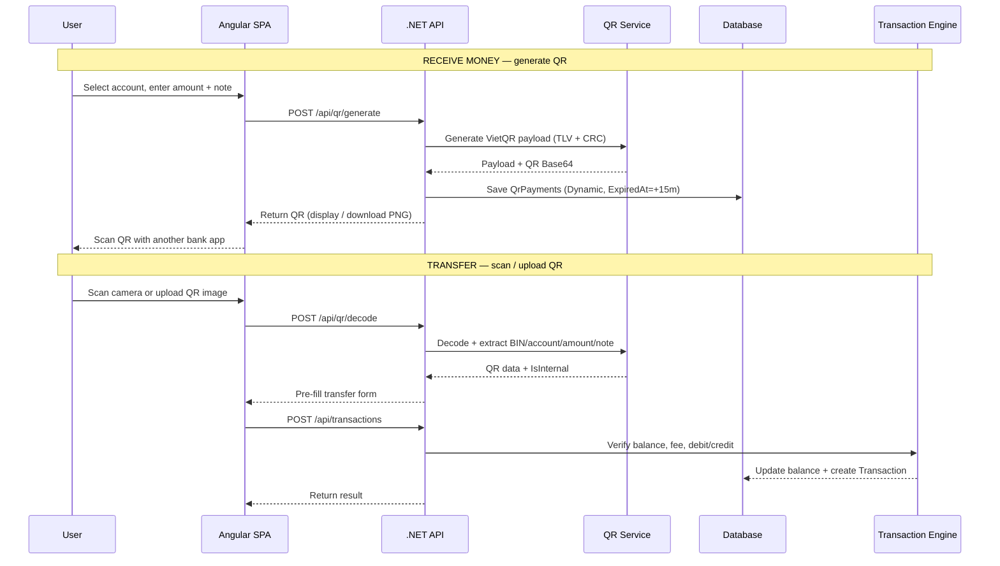
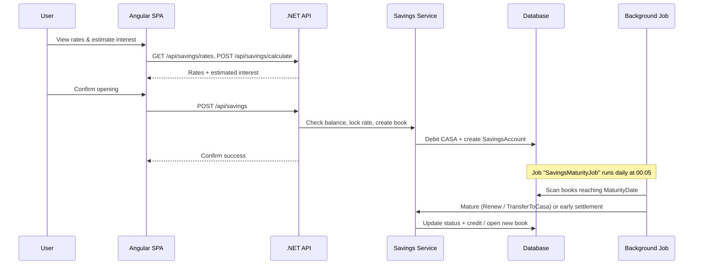
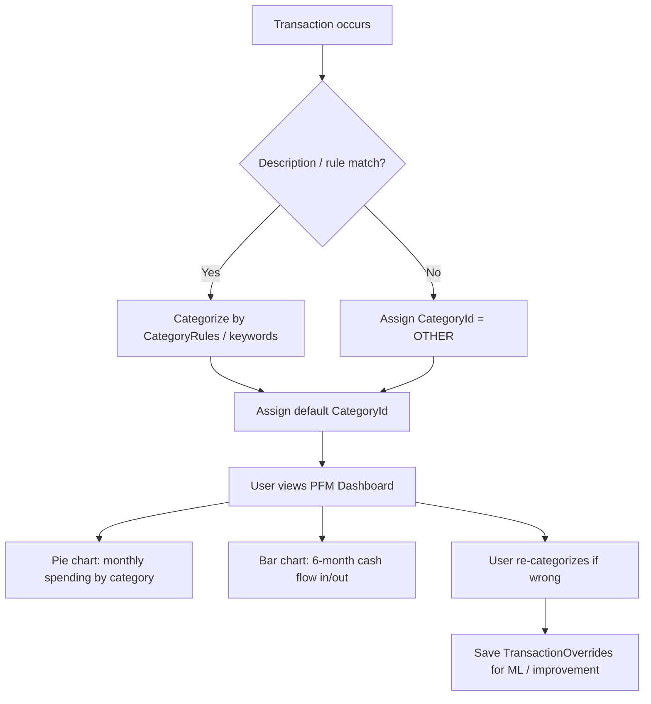
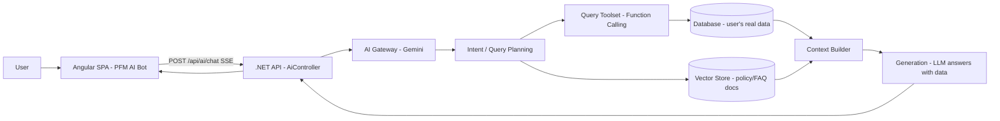
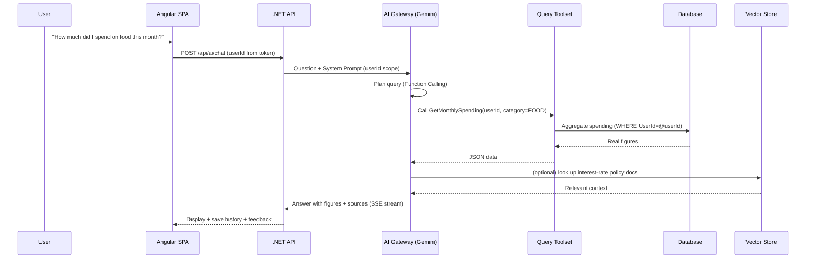

# MASTER TECHNICAL SPECIFICATION
**Project:** Smart Online Banking & Financial Management Platform

**Role:** Senior Software Architect / Technical Lead

**Tech Stack:**

- **Backend:** .NET 10 (Clean Architecture, CQRS with MediatR, Entity Framework Core, Quartz.NET, System.Threading.Channels).
- **Frontend:** Angular 21 (Container / Presentational Pattern, Shell Layout, RxJS) + PrimeNG (UI Component Library — System Design).
- **Database & Tooling:** SQL Server / PostgreSQL (administration & tuning via DBeaver).

---

## I. SYSTEM ARCHITECTURE

The system is designed as a **Distributed Monolith / Clean Architecture** with internal **Event-Driven** orientation (In-Memory Async Queue), ensuring scalability, financial data integrity (ACID), and high response performance.

```
┌───────────────────────────────────────────────────────────────────────────────────┐
│                               ANGULAR SPA (CLIENT)                                │
│        [Shell Layout] ──► [Container Components] ──► [Presentational UI]          │
└─────────────────────────────────────────┬─────────────────────────────────────────┘
                                          │ HTTPS / REST API / JSON
                                          ▼
┌───────────────────────────────────────────────────────────────────────────────────┐
│                              .NET 10 API GATEWAY                                  │
│                 [Authentication & Captcha Middleware / CORS / Rate-Limit]         │
└─────────────────────────────────────────┬─────────────────────────────────────────┘
                                          │
                                          ▼
┌───────────────────────────────────────────────────────────────────────────────────┐
│                             APPLICATION LAYER (CQRS)                              │
│         ┌──────────────────────────────┐     ┌──────────────────────────────┐     │
│         │      Commands (Write)        │     │       Queries (Read)         │     │
│         └──────────────┬───────────────┘     └──────────────┬───────────────┘     │
└────────────────────────┼────────────────────────────────────┼─────────────────────┘
                         │                                    │
                         ▼                                    ▼
┌────────────────────────────────────────┐   ┌──────────────────────────────────────┐
│        INFRASTRUCTURE LAYER            │   │            DOMAIN LAYER              │
│  ├── EF Core (DB Transactions / ACID)  │   │  ├── Entities & Enums                │
│  ├── Quartz.NET (Cron Jobs / Interest) │   │  ├── Domain Events                   │
│  ├── System.Threading.Channels (Queue) │   │  └── Value Objects                   │
│  ├── Smtp/SMS Notification Worker      │   └──────────────────────────────────────┘
│  └── AI Engine (Gemini / RAG Integration)  │
└────────────────────────┬───────────────┘
                         │
                         ▼
┌───────────────────────────────────────────────────────────────────────────────────┐
│                           DATABASE (SQL SERVER / DBEAVER)                         │
└───────────────────────────────────────────────────────────────────────────────────┘
```

## II. DATABASE SCHEMA DESIGN (DBEAVER)

The database is designed to 3NF, with appropriate indexes on high-traffic search/query fields.

```
┌──────────────┐       1:N       ┌──────────────────┐       1:N       ┌──────────────────┐
│    Users     ├─────────────────►     Accounts     ├─────────────────►   Transactions   │
└──────┬───────┘                 └────────┬─────────┘                 └──────────────────┘
       │                                  │
       │ 1:N                              │ 1:1
       ▼                                  ▼
┌──────────────┐                 ┌──────────────────┐
│SavingsAccounts                 │AutoEarningSubs   │
└──────────────┘                 └────────┬─────────┘
                                          │ 1:N
                                          ▼
                                 ┌──────────────────┐
                                 │DailyInterestLogs │
                                 └──────────────────┘
```

Extended schema for the 4 new features (details in Sections III–VI):

```
┌──────────────┐   1:N   ┌────────────────────────┐   1:N   ┌─────────────────────┐
│    Users     ├─────────►    SavingsAccounts      ├─────────►  InterestAccruals    │
└──────┬───────┘         └──────────┬─────────────┘         └─────────────────────┘
       │                            │ N:1
       │ 1:N                        ▼
       ▼                   ┌────────────────────────┐
┌──────────────┐           │     InterestRates      │
│  QrPayments  │           │  (dynamic term rates)  │
└──────────────┘           └────────────────────────┘

┌──────────────────┐   N:1   ┌─────────────────────┐
│   Transactions   ├─────────►      Categories      │
└──────────────────┘         │  (spending categories)│
                             └─────────────────────┘

┌──────────────┐   1:N   ┌─────────────────────┐   1:N   ┌─────────────────────┐
│    Users     ├─────────►   AiConversations    ├─────────►      AiMessages     │
└──────────────┘         └─────────────────────┘         └─────────────────────┘
```

Note: All relationships, fields, indexes, and constraints of each module are detailed in Sections III–VI below.

---

## III. FEATURE 1 — QR PAYMENT / MONEY TRANSFER VIA QR CODE (VIETQR STANDARD)

### 1. Business Context
Users rarely type account numbers manually when transferring money today — they mostly **scan a QR code**. The **VietQR / NAPAS 247** standard (built on EMVCo) is chosen as the single standard to:
- **Receive money:** the bank generates a dynamic QR containing account number, amount, and note; the payer only needs to scan it.
- **Transfer money:** the user scans the QR from camera or uploads a QR image; the system extracts the account number + bank (BIN) + amount → **pre-fills** the transfer form, reducing errors and manual work.

### 2. Functional Requirements
| # | Function | Description |
|---|-----------|-------|
| QR-1 | **Generate dynamic VietQR (receive money)** | User selects receiving account, enters amount + note → system generates EMVCo/VietQR payload and renders a QR shown on screen or downloadable as PNG. |
| QR-2 | **Scan / upload QR image (transfer)** | Scan via camera or upload a QR image (PNG/JPG) → system decodes and extracts BIN → bank name, account number, amount, note → pre-fills the form. |
| QR-3 | **Verify QR data** | Check valid CRC; internal BIN → `InternalTransfer`; external BIN → `InterbankTransfer`. |
| QR-4 | **Execute transfer** | Reuse the existing `CreateTransactionCommand` (balance check, fee, debit/credit, transaction code). |
| QR-5 | **QR history** | Store history of created/scanned QRs with status (unpaid / paid / expired). |

### 3. VietQR / NAPAS 247 — Payload Structure (TLV)
Built per the EMV QR Code Specification (Consumer Presented Mode) with Tag-Length-Value (TLV) structure:

| Tag | Field | Value / Note |
|-----|--------|-------------------|
| `00` | Payload Format Indicator | `"01"` (fixed) |
| `01` | Point of Initiation Method | `"11"` = dynamic QR, `"12"` = static QR |
| `38` | Merchant Account Information (NAPAS) | Sub-block: `00`=GUID `"A000000727"` (NAPAS); `01`=beneficiary bank BIN (6 digits, e.g. VCB=`970436`); `02`=beneficiary account number; `03`=account holder name (optional) |
| `52` | Merchant Category Code | `"0000"` |
| `53` | Transaction Currency | `"704"` (VND) |
| `54` | Transaction Amount | Only in dynamic QR |
| `58` | Country Code | `"VN"` |
| `59` | Merchant Name | Max 25 characters |
| `60` | Merchant City | Branch / city (optional) |
| `62` | Additional Data | Sub-block `05` = **transfer note** (BillNumber, max 25 chars) |
| `63` | CRC | Computed per EMVCo algorithm for integrity |

> The BIN table is managed in the `Banks` table (field `BinCode`) — used to map BIN → bank name when decoding QR.

### 4. Database Design
**New table: `QrPayments`**

| Column | Type | Note |
|-----|------|---------|
| `Id` | string (PK) | GUID |
| `AccountId` | string (FK → `Accounts.Id`) | Receiving account |
| `AccountNumber` | string | Account number extracted from QR |
| `BankBin` | string (6) | Bank BIN |
| `BankName` | string | Bank name (mapped from `Banks`) |
| `Amount` | decimal? | Amount (NULL for static QR) |
| `Content` | string (≤25) | Transfer note |
| `QrType` | enum (`Static`/`Dynamic`) | QR type |
| `RawPayload` | string | Original TLV payload (for verification) |
| `Status` | enum (`Pending`/`Matched`/`Paid`/`Expired`) | Status |
| `ExpiredAt` | datetime? | Validity (dynamic QR = +15 minutes) |
| `IsActive` | bool | Soft delete |

### 5. API Design
| Method | Route | Request | Response | Description |
|--------|-------|---------|----------|-------|
| `POST` | `/api/qr/generate` | `{ AccountId, Amount?, Content? }` | `{ QrId, Payload, QrBase64, ExpiredAt? }` | Generate dynamic VietQR |
| `POST` | `/api/qr/decode` | multipart: QR image *or* `{ Payload }` | `{ BankBin, BankName, AccountNumber, Amount?, Content?, IsInternal }` | Decode & extract data |
| `GET` | `/api/qr/{id}` | — | `{ QrId, Payload, QrBase64, ... }` | Re-download / get detail |
| `GET` | `/api/qr?accountId=` | — | QR list | QR history |
| `POST` | `/api/transactions` | (pre-filled data from QR) | `TransactionDto` | Execute transfer (shared) |

### 6. Processing Flow


### 7. Business Rules
- Dynamic QR is valid for **15 minutes** (NAPAS recommendation); after expiry it must be recreated (status → `Expired`).
- Amount must be `> 0`; transfer note ≤ **25 characters** (NAPAS).
- On decode: **CRC must be verified**; invalid payload → reject with a clear message.
- Internal BIN → `InternalTransfer` (fee 0 VND); external BIN → `InterbankTransfer` (fee **5,000 VND**).
- Receiver account must be `IsActive = true`; users can only scan/manage their own QRs (ownership check on `AccountId`).

---

## IV. FEATURE 2 — ONLINE SAVINGS (FIXED DEPOSIT)

### 1. Business Context
Savings products are the bank's main revenue source and help users earn on idle balances. The system supports opening online term savings with a **dynamic interest rate table** (`InterestRates`) managed by the bank.

### 2. Functional Requirements
| # | Function | Description |
|---|-----------|-------|
| SV-1 | **Open online savings** | Choose term (1, 3, 6, 12 months), enter amount; the rate is **locked at opening time** from the current `InterestRates` table. |
| SV-2 | **Live Calculator** | Enter amount + term → estimate interest and maturity amount in real time. |
| SV-3 | **Auto maturity** | A background job scans books reaching `MaturityDate` → processes per option: **Renew** (principal + interest into a new term) or **Transfer to CASA**. |
| SV-4 | **Early settlement** | User settles early; interest is computed at the **demand rate** on actual days; requires confirmation (modal) because interest is reduced. |
| SV-5 | **Track savings books** | List of books, book detail (principal, rate, maturity date, accrued interest, status). |

### 3. Interest Formulas
- **Simple interest at maturity:** $$Interest = Principal \times \frac{AnnualRate}{100} \times \frac{TermMonths}{12}$$
- **By day (early settlement):** $$Interest = Principal \times \frac{DemandRate}{100} \times \frac{ActualDays}{365}$$
- **Example:** 10,000,000 VND, 6-month term, 4.5%/year:
  $$Interest = 10,000,000 \times 4.5\% \times \frac{6}{12} = 225,000\ \text{VND}$$
- Rate-lock rule: **the rate at opening date applies** and does not change during the term.

### 4. Database Design
**New table: `SavingsAccounts`**

| Column | Type | Note |
|-----|------|---------|
| `Id` | string (PK) | GUID |
| `UserId` | string (FK → `Users.Id`) | Owner |
| `SourceAccountId` | string (FK → `Accounts.Id`) | CASA account for debit / maturity credit |
| `DepositAmount` | decimal | Principal |
| `InterestRate` | decimal | Locked rate (%/year) |
| `TermMonths` | int (1/3/6/12) | Term |
| `StartDate` | datetime | Opening date |
| `MaturityDate` | datetime | Maturity date |
| `Status` | enum (`Active`/`Matured`/`EarlyClosed`/`Failed`) | Status |
| `MaturityOption` | enum (`Renew`/`TransferToCasa`) | Maturity option |
| `InterestEarned` | decimal | Accrued / expected interest |
| `ClosedDate` | datetime? | Settlement date |

**New table: `InterestRates`** (dynamic rates — admin managed)
`Id`, `TermMonths` (int), `Rate` (decimal %/year), `EffectiveFrom` (datetime), `EffectiveTo` (datetime?), `IsActive` (bool)

**New table: `InterestAccruals`** (daily interest log for accrued interest / reconciliation)
`Id`, `SavingsAccountId` (FK), `Date`, `DailyInterest`, `Status`

**Business operations:**
- **Open:** debit CASA (note "Open savings") → create `SavingsAccount`.
- **Maturity / settlement:** credit CASA (or open a new book on renew) → update book status.

### 5. API Design
| Method | Route | Request | Response | Description |
|--------|-------|---------|----------|-------|
| `GET` | `/api/savings/rates` | — | list `{ TermMonths, Rate }` | Current rates |
| `POST` | `/api/savings/calculate` | `{ Amount, TermMonths }` | `{ Rate, Interest, MaturityAmount }` | Live calculator |
| `POST` | `/api/savings` | `{ UserId, SourceAccountId, Amount, TermMonths, MaturityOption }` | `SavingsAccountDto` | Open savings |
| `GET` | `/api/savings?userId=` | — | list of books | User's books |
| `GET` | `/api/savings/{id}` | — | `SavingsAccountDto` | Book detail |
| `POST` | `/api/savings/{id}/close` | `{ Confirm }` | `CloseResultDto` | Early settlement |

### 6. Processing Flow


### 7. Business Rules
- **Minimum amount:** 1,000,000 VND; maximum per admin-configured limit.
- Rate is **locked at opening** and does not change during the term.
- Early settlement → interest at the **demand rate** (much lower); requires clear confirmation.
- Source CASA must be `IsActive` and have sufficient balance at opening.
- One `SavingsAccount` links to one CASA; all resulting transactions must be recorded in `Transactions` for reconciliation.

---

## V. FEATURE 3 — PERSONAL FINANCE MANAGEMENT (PFM)

### 1. Business Context
Helps users know **"where did my money go"** instead of just viewing a flat transaction list. PFM automatically categorizes spending and visualizes it with charts, providing a clear personal-finance perspective.

### 2. Functional Requirements
| # | Function | Description |
|---|-----------|-------|
| PF-1 | **Auto-categorize transactions** | When a transaction occurs, the system assigns a category: *Food, Shopping, Bills, Savings, Entertainment, Transport, Other*. |
| PF-2 | **Pie chart dashboard** | Monthly spending breakdown by category (SVG donut chart). |
| PF-3 | **Bar chart** | Cash flow in/out comparison over the last 6 months. |
| PF-4 | **Manual re-categorization** | User corrects a category; the system records the preference to improve later. |
| PF-5 | **Detailed statistics** | Period totals, top transactions, spending by category. |

### 3. Auto-Categorization Engine
1. New transaction → triggers the categorization engine.
2. Categorize by **keywords** in `Description`/transfer note via the `CategoryRules` table (e.g. `Grab`/`Xe` → Transport; `Điện`/`Nước`/`Internet` → Bills; `Ăn`/`Restaurant`/`Food` → Food; `Mua`/`Shop` → Shopping; `Phim`/`Game`/`Netflix` → Entertainment; `TKS`/`Tiết kiệm` → Savings).
3. No rule match → default **`Other`**.
4. User edits manually → save override (optional machine learning later).

### 4. Database Design
**New table: `Categories`**
`Id`, `Code` (e.g. `FOOD`, `SHOPPING`, `BILL`, `SAVING`, `ENTERTAINMENT`, `TRANSPORT`, `OTHER`), `Name` (Vietnamese), `Color`, `Icon`, `IsDefault`

**New table: `CategoryRules`** (categorization rules)
`Id`, `CategoryId` (FK), `Keyword`, `Priority` (int), `IsActive`

**Change to `Transactions`:**
- Add `CategoryId` (string?, FK → `Categories.Id`) — nullable, assigned on categorization.
- (Optional) `TransactionOverrides`: `UserId`, `TransactionId`, `CategoryId` — records manual edits.

**Statistics rules:**
- Only **expense** transactions count in the pie chart.
- Transfers between **two accounts of the same user** are **not** counted as income/expense (excluded to avoid noise).
- Transfers to other banks / withdrawals / bill payments count as expense.

### 5. API Design
| Method | Route | Request | Response | Description |
|--------|-------|---------|----------|-------|
| `GET` | `/api/pfm/categories` | — | list `CategoryDto` | Category list |
| `GET` | `/api/pfm/summary` | `{ userId, from, to }` | `{ TotalIncome, TotalExpense, ByCategory[] }` | Pie chart data |
| `GET` | `/api/pfm/cashflow` | `{ userId, months=6 }` | `[{ Month, Income, Expense }]` | Bar chart data |
| `GET` | `/api/pfm/top` | `{ userId, from, to, n=10 }` | transaction list | Top expenses |
| `PUT` | `/api/transactions/{id}/category` | `{ CategoryId }` | `TransactionDto` | User re-categorizes |
| `POST` | `/api/pfm/categories` | `CategoryDto` | `CategoryDto` | Category CRUD (admin) |

> Statistics results may be **cached** (e.g. 5 minutes) because the data is read-only, reducing DB load.

### 6. Processing Flow


### 7. Business Rules
- Auto-categorization is only a suggestion; users may always edit.
- PFM data is shown **only for the logged-in user** (no cross-user; secured by `userId` from token).
- Same-user internal transfers don't count as income/expense; refunds reduce expense.
- Charts are built with **pure SVG** on the frontend (no heavy chart library) — consistent with the current stack.

---

## VI. FEATURE 4 — PERSONAL FINANCE AI ASSISTANT (RAG AI ASSISTANT)

### 1. Business Context
AI acts as a **personal finance advisor for each user**. Instead of generic answers, AI **queries the user's real spending data in the DB** to provide personalized, evidence-based analysis.

### 2. Functional Requirements
| # | Function | Description |
|---|-----------|-------|
| AI-1 | **Q&A based on real data** | *"How much did I spend on food this month?"*, *"Should I open a 6-month savings?"* — AI retrieves real numbers from the DB to answer. |
| AI-2 | **Savings / finance advice** | Compare options and recommend based on the user's actual cash flow and spending behavior. |
| AI-3 | **Streaming responses** | Stream answers (SSE) to improve UX. |
| AI-4 | **Transparent sources** | Show the data/query used so the user can verify. |
| AI-5 | **Feedback** | User rates correct/incorrect → improves prompts (feedback loop). |

### 3. RAG Architecture (Retrieval-Augmented Generation)

**Two retrieval channels:**
1. **Structured Data Retrieval (required):** AI calls **whitelisted tools** (Function Calling) to get real DB data — spending by category, monthly cash flow, savings list, top transactions...
2. **Vector Retrieval (supplementary):** find banking knowledge documents (FAQ, interest rate rules, terms) via a vector store.

### 4. Component Design (Backend)
| Component | Responsibility |
|------------|-------------|
| `AiController` | `POST /api/ai/chat` (SSE stream), `GET /api/ai/sessions`, `POST /api/ai/feedback` |
| `AiGateway` (Gemini client) | Call LLM, manage API key, retry/timeout |
| `QueryToolset` | Safe tools: `GetMonthlySpending(userId, category?)`, `GetCashflow(userId, months)`, `GetSavingsSummary(userId)`, `GetTopTransactions(userId, n)` — **every query constrained `WHERE UserId = @userId`** |
| `ContextBuilder` | Convert raw data (JSON) into compact context before passing to the LLM |
| `EmbeddingService` + `VectorStore` | Index policy/FAQ docs (pgvector or Azure AI Search) |
| `ConversationStore` | Store conversation history per user (`AiConversations`, `AiMessages`) |
| `PromptTemplate` | System prompt with `userId` scoping; rule "only use provided data, never invent figures" |
| `Guardrail` | Prevent prompt injection, limit data scope per user, rate-limit |

### 5. API Design
| Method | Route | Request | Response | Description |
|--------|-------|---------|----------|-------|
| `POST` | `/api/ai/chat` | `{ userId, message, sessionId? }` | **SSE stream** answer + `sources[]` | Chat with AI |
| `GET` | `/api/ai/sessions/{id}/messages` | — | conversation history | Read history |
| `POST` | `/api/ai/feedback` | `{ messageId, rating, comment? }` | `Ok` | Feedback |

> `userId` is taken from the **auth token**, not trusted from the client — ensuring AI only accesses the user's own data.

### 6. Processing Flow


### 7. Security & Business Rules
- **Only access the authenticated user's data** — userId from token, every tool query constrained `WHERE UserId = @userId`.
- **Whitelisted tools:** no arbitrary SQL from the LLM → prevents SQL injection & cross-user leakage.
- **Anti prompt-injection:** hide internal structure, never disclose disallowed commands/tools.
- **Disclaimer:** results are for **reference**, not official investment advice.
- **Rate-limit per user** to avoid LLM API cost abuse.

---

## VII. ROADMAP & STATUS

| Phase | Content | Note |
|-----------|----------|---------|
| **P1 — Existing foundation** | CRUD Users / Accounts / Transactions, CQRS + MediatR, separated read/write repos, exception middleware | Already in code |
| **P2 — Feature III (VietQR)** | `Banks`/`BinCode`, `QrPayments`, QR service (generate/decode), integrate into transfer form | To be added |
| **P3 — Feature IV (Savings)** | `InterestRates`, `SavingsAccounts`, `InterestAccruals`, Live Calculator, maturity background job | To be added |
| **P4 — Feature V (PFM)** | `Categories`, `CategoryRules`, auto-categorization, summary/cashflow APIs, dashboard charts | To be added |
| **P5 — Feature VI (RAG AI)** | AiGateway (Gemini), QueryToolset, VectorStore, SSE chat, guardrail | To be added |
| **P6 — Security & infrastructure** | JWT auth, password hashing (BCrypt/Identity), CORS, rate-limit, captcha, EF Core migrations | To be added |

> **Transparency note:** This document describes the **target design** for the 4 new features. Sections III–VI are technical specifications to be implemented along the P2–P5 roadmap; the current code status is cross-referenced in the roadmap table above.
>
> **Frontend update:** The UI has moved to **PrimeNG** as the primary design system (instead of pure Tailwind) — components like `p-chart`, `p-table`, `p-tabs`, `p-password`, `p-button`, `p-card`, `p-avatar`, `p-tag`... are used consistently across the SPA, combined with Tailwind for layout/custom styles.
