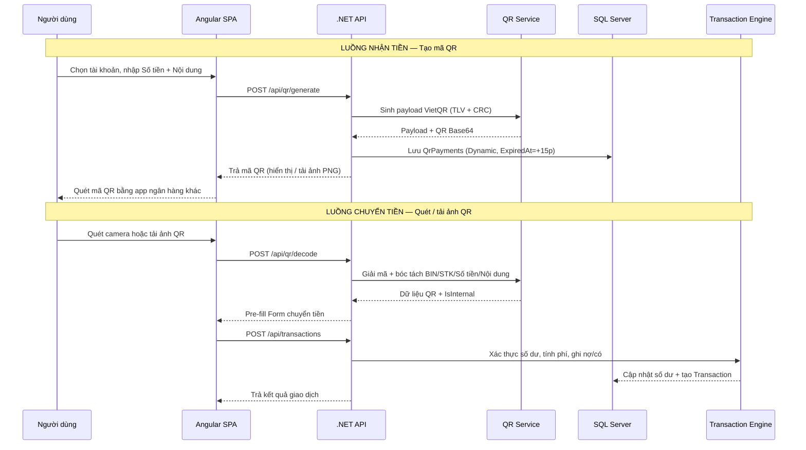
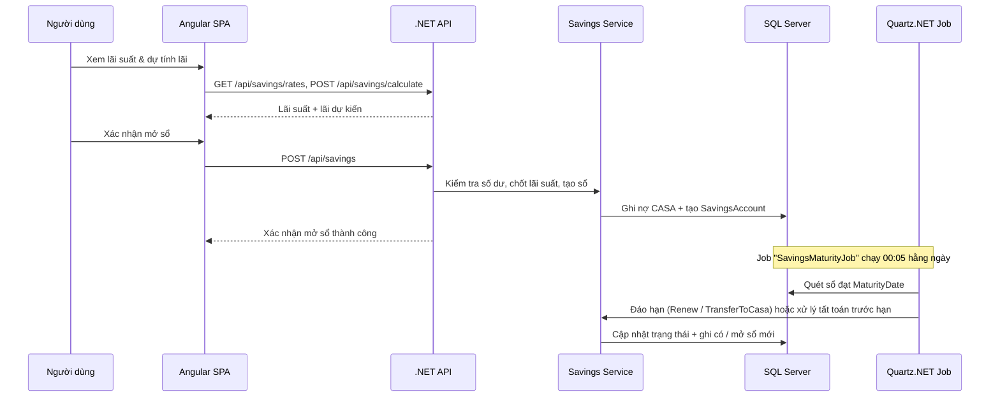
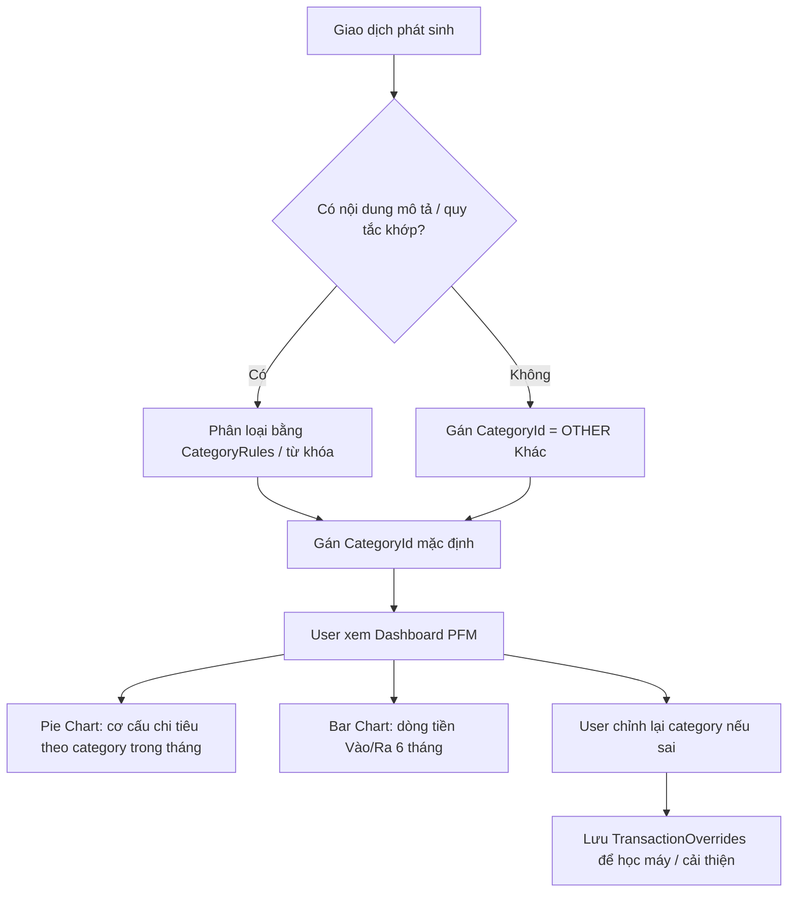
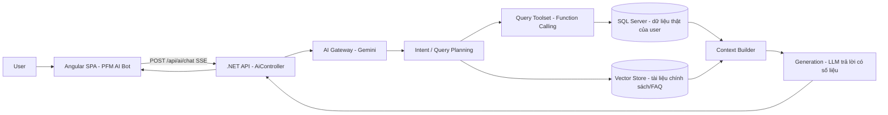
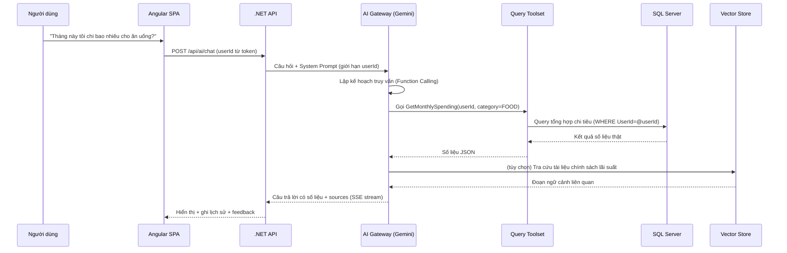

BẢN KẾ HOẠCH & THIẾT KẾ HỆ THỐNG TỔNG THỂ (MASTER TECHNICAL SPECIFICATION)
Dự án: Smart Online Banking & Financial Management Platform

Vai trò: Senior Software Architect / Technical Lead

Tech Stack:

Backend: .NET 10 (Clean Architecture, CQRS with MediatR, Entity Framework Core, Quartz.NET, System.Threading.Channels).

Frontend: Angular 21 (Container / Presentational Pattern, Shell Layout, RxJS) + PrimeNG (UI Component Library — System Design).

Database & Tooling: SQL Server / PostgreSQL (Quản trị & tối ưu qua DBeaver).

I. KIẾN TRÚC HỆ THỐNG CHỦ ĐẠO (SYSTEM ARCHITECTURE)
Hệ thống được thiết kế theo mô hình Distributed Monolith / Clean Architecture hướng Event-Driven nội bộ (In-Memory Async Queue), đảm bảo khả năng mở rộng (Scalability), tính toàn vẹn dữ liệu tài chính (ACID) và hiệu năng phản hồi cao.

┌───────────────────────────────────────────────────────────────────────────────────┐
│                               ANGULAR SPA (CLIENT)                                │
│        [Shell Layout] ──► [Container Components] ──► [Presentational UI]          │
└─────────────────────────────────────────┬─────────────────────────────────────────┘
                                          │ HTTPS / REST API / JSON
                                          ▼
┌───────────────────────────────────────────────────────────────────────────────────┐
│                              .NET 10 API GATEWAY                                  │
│                 [Authentication & Captcha Middleware / CORS / Rate-Limit]         │
└─────────────────────────────────────────┬─────────────────────────────────────────┘
                                          │
                                          ▼
┌───────────────────────────────────────────────────────────────────────────────────┐
│                             APPLICATION LAYER (CQRS)                              │
│         ┌──────────────────────────────┐     ┌──────────────────────────────┐     │
│         │      Commands (Write)        │     │       Queries (Read)         │     │
│         └──────────────┬───────────────┘     └──────────────┬───────────────┘     │
└────────────────────────┼────────────────────────────────────┼─────────────────────┘
                         │                                    │
                         ▼                                    ▼
┌────────────────────────────────────────┐   ┌──────────────────────────────────────┐
│        INFRASTRUCTURE LAYER            │   │            DOMAIN LAYER              │
│  ├── EF Core (DB Transactions / ACID)  │   │  ├── Entities & Enums                │
│  ├── Quartz.NET (Cron Jobs / Interest) │   │  ├── Domain Events                   │
│  ├── System.Threading.Channels (Queue) │   │  └── Value Objects                   │
│  ├── Smtp/SMS Notification Worker      │   └──────────────────────────────────────┘
│  └── AI Engine (Gemini / RAG Integration)  │
└────────────────────────┬───────────────┘
                         │
                         ▼
┌───────────────────────────────────────────────────────────────────────────────────┐
│                           DATABASE (SQL SERVER / DBEAVER)                         │
└───────────────────────────────────────────────────────────────────────────────────┘
II. THIẾT KẾ CƠ SỞ DỮ LIỆU CHUYÊN SÂU (DATABASE SCHEMA - DBEAVER)
Cơ sở dữ liệu được thiết kế đạt chuẩn 3NF, cài đặt Index hợp lý tại các trường tìm kiếm/truy vấn giao dịch cao.

┌──────────────┐       1:N       ┌──────────────────┐       1:N       ┌──────────────────┐
│    Users     ├─────────────────►     Accounts     ├─────────────────►   Transactions   │
└──────┬───────┘                 └────────┬─────────┘                 └──────────────────┘
       │                                  │
       │ 1:N                              │ 1:1
       ▼                                  ▼
┌──────────────┐                 ┌──────────────────┐
│SavingsAccounts                 │AutoEarningSubs   │
└──────────────┘                 └────────┬─────────┘
                                          │ 1:N
                                          ▼
                                 ┌──────────────────┐
                                 │DailyInterestLogs │
                                 └──────────────────┘

Mở rộng lược đồ cho 04 tính năng mới (chi tiết từng module tại Mục III – VI):

┌──────────────┐   1:N   ┌────────────────────────┐   1:N   ┌─────────────────────┐
│    Users     ├─────────►    SavingsAccounts      ├─────────►  InterestAccruals    │
└──────┬───────┘         └──────────┬─────────────┘         └─────────────────────┘
       │                            │ N:1
       │ 1:N                        ▼
       ▼                   ┌────────────────────────┐
┌──────────────┐           │     InterestRates      │
│  QrPayments  │           │  (Lãi suất động kỳ hạn) │
└──────────────┘           └────────────────────────┘

┌──────────────────┐   N:1   ┌─────────────────────┐
│   Transactions   ├─────────►      Categories      │
└──────────────────┘         │  (Phân loại chi tiêu) │
                             └─────────────────────┘

┌──────────────┐   1:N   ┌─────────────────────┐   1:N   ┌─────────────────────┐
│    Users     ├─────────►   AiConversations    ├─────────►      AiMessages     │
└──────────────┘         └─────────────────────┘         └─────────────────────┘

Ghi chú: Toàn bộ quan hệ, trường dữ liệu, index và ràng buộc của từng module được trình bày chi tiết tại các Mục III – VI dưới đây.

---

# III. CHỨC NĂNG 1 — THANH TOÁN / CHUYỂN TIỀN QUA MÃ QR (VIETQR STANDARD)

## 1. Bối cảnh nghiệp vụ (Business Context)
Người dùng hiện nay gần như không còn nhập tay Số Tài Khoản (STK) khi chuyển tiền mà chủ yếu **quét mã QR**. Mã QR chuẩn **VietQR / NAPAS 247** (xây dựng trên nền chuẩn EMVCo) được chọn làm chuẩn duy nhất để:
- **Nhận tiền:** Ngân hàng sinh mã QR động chứa STK, Số tiền, Nội dung chuyển tiền; người trả tiền chỉ cần quét là có sẵn toàn bộ thông tin.
- **Chuyển tiền:** Người dùng quét QR từ camera hoặc tải ảnh QR lên, hệ thống tự bóc tách STK + Ngân hàng (BIN) + Số tiền → **pre-fill** vào Form chuyển tiền, giảm sai sót và thao tác thủ công.

## 2. Yêu cầu chức năng (Functional Requirements)
| # | Chức năng | Mô tả |
|---|-----------|-------|
| QR-1 | **Tạo mã VietQR động (Nhận tiền)** | Người dùng chọn tài khoản nhận, nhập Số tiền + Nội dung → hệ thống sinh payload chuẩn EMVCo/VietQR, render thành mã QR hiển thị trên màn hình hoặc tải về dạng ảnh PNG. |
| QR-2 | **Quét / Tải ảnh QR (Chuyển tiền)** | Quét trực tiếp bằng camera hoặc tải ảnh QR lên (PNG/JPG) → hệ thống giải mã, bóc tách BIN → tên ngân hàng, STK, Số tiền, Nội dung → điền sẵn vào Form. |
| QR-3 | **Xác minh dữ liệu QR** | Kiểm tra CRC hợp lệ; BIN thuộc ngân hàng nội bộ → `InternalTransfer`; BIN ngân hàng khác → `InterbankTransfer`. |
| QR-4 | **Thực hiện chuyển tiền** | Tái sử dụng nghiệp vụ `CreateTransactionCommand` hiện có (kiểm tra số dư, phí, ghi nợ/có, sinh mã giao dịch). |
| QR-5 | **Lịch sử QR** | Lưu lịch sử các mã QR đã tạo/quét, trạng thái (chưa thanh toán / đã thanh toán / hết hạn). |

## 3. Chuẩn VietQR / NAPAS 247 — Cấu trúc Payload (TLV)
Mã VietQR được xây dựng theo **EMV QR Code Specification for Payment Systems (Consumer Presented Mode)** với cấu trúc Tag-Length-Value (TLV):

| Tag | Trường | Giá trị / Ghi chú |
|-----|--------|-------------------|
| `00` | Payload Format Indicator | `"01"` (cố định) |
| `01` | Point of Initiation Method | `"11"` = QR động (có số tiền), `"12"` = QR tĩnh |
| `38` | Merchant Account Information (NAPAS) | Khối con: `00`=GUID `"A000000727"` (NAPAS); `01`=BIN ngân hàng thụ hưởng (6 số, VD VCB=`970436`); `02`=STK thụ hưởng; `03`=Tên chủ tài khoản (tùy chọn) |
| `52` | Merchant Category Code | `"0000"` |
| `53` | Transaction Currency | `"704"` (VND) |
| `54` | Transaction Amount | Chỉ có ở QR động (có số tiền) |
| `58` | Country Code | `"VN"` |
| `59` | Merchant Name | Tối đa 25 ký tự |
| `60` | Merchant City | Tên chi nhánh / thành phố (tùy chọn) |
| `62` | Additional Data | Khối con `05` = **Nội dung chuyển tiền** (BillNumber, tối đa 25 ký tự) |
| `63` | CRC | Tính theo thuật toán EMVCo để chống sai lệch dữ liệu |

> Bảng BIN ngân hàng được quản lý sẵn trong bảng `Banks` (trường `BinCode`) — dùng để mapping BIN → tên ngân hàng khi decode QR.

## 4. Thiết kế cơ sở dữ liệu
**Bảng mới: `QrPayments`** (lưu mã QR đã tạo / ảnh QR đã quét)

| Cột | Kiểu | Ghi chú |
|-----|------|---------|
| `Id` | string (PK) | GUID |
| `AccountId` | string (FK → `Accounts.Id`) | Tài khoản nhận tiền |
| `AccountNumber` | string | STK bóc tách được từ QR |
| `BankBin` | string (6) | Mã BIN ngân hàng |
| `BankName` | string | Tên ngân hàng (map từ `Banks`) |
| `Amount` | decimal? | Số tiền (NULL với QR tĩnh) |
| `Content` | string (≤25) | Nội dung chuyển tiền |
| `QrType` | enum (`Static`/`Dynamic`) | Loại mã QR |
| `RawPayload` | string | Payload TLV gốc (phục vụ kiểm tra) |
| `Status` | enum (`Pending`/`Matched`/`Paid`/`Expired`) | Trạng thái |
| `ExpiredAt` | datetime? | Hiệu lực (QR động = +15 phút) |
| `IsActive` | bool | Mềm xóa |

## 5. Thiết kế API
| Method | Route | Request | Response | Mô tả |
|--------|-------|---------|----------|-------|
| `POST` | `/api/qr/generate` | `{ AccountId, Amount?, Content? }` | `{ QrId, Payload, QrBase64, ExpiredAt? }` | Sinh mã VietQR động để nhận tiền |
| `POST` | `/api/qr/decode` | multipart: file ảnh QR *hoặc* `{ Payload }` | `{ BankBin, BankName, AccountNumber, Amount?, Content?, IsInternal }` | Giải mã & bóc tách dữ liệu từ ảnh QR |
| `GET` | `/api/qr/{id}` | — | `{ QrId, Payload, QrBase64, ... }` | Tải lại mã QR / lấy chi tiết |
| `GET` | `/api/qr?accountId=` | — | danh sách QR | Lịch sử mã QR |
| `POST` | `/api/transactions` | (dữ liệu pre-fill từ QR) | `TransactionDto` | Thực hiện chuyển tiền (dùng chung hiện có) |

## 6. Luồng xử lý

## 7. Ràng buộc & Quy tắc nghiệp vụ (Business Rules)
- QR động có hiệu lực **15 phút** (khuyến nghị NAPAS); hết hạn phải tạo mới, trạng thái chuyển `Expired`.
- Số tiền phải `> 0`; Nội dung chuyển tiền ≤ **25 ký tự** (theo chuẩn NAPAS).
- Khi decode: **bắt buộc kiểm tra CRC**; payload không hợp lệ → từ chối kèm thông báo rõ ràng.
- BIN nội bộ → `InternalTransfer` (phí 0 VND); BIN khác → `InterbankTransfer` (phí **5.000 VND** theo quy định hiện tại).
- Tài khoản nhận phải `IsActive = true`; người dùng chỉ được quét/quản lý QR của chính mình (kiểm tra quyền sở hữu `AccountId`).

---

# IV. CHỨC NĂNG 2 — GỬI TIẾT KIỆM ONLINE (ONLINE SAVINGS / FIXED DEPOSIT)

## 1. Bối cảnh nghiệp vụ (Business Context)
Sản phẩm tiết kiệm là **nguồn lợi nhuận chính** của ngân hàng đồng thời giúp người dùng sinh lời trên số dư nhàn rỗi. Hệ thống hỗ trợ mở sổ tiết kiệm online theo kỳ hạn với **bảng lãi suất động** (`InterestRates`) do ngân hàng quản lý và cập nhật linh hoạt.

## 2. Yêu cầu chức năng (Functional Requirements)
| # | Chức năng | Mô tả |
|---|-----------|-------|
| SV-1 | **Mở sổ tiết kiệm online** | Chọn kỳ hạn (1, 3, 6, 12 tháng), nhập số tiền; lãi suất được **chốt tại thời điểm mở sổ** từ bảng `InterestRates` hiện hành. |
| SV-2 | **Live Calculator** | Nhập Số tiền + Kỳ hạn → dự tính tiền lãi & số tiền nhận khi đáo hạn theo thời gian thực. |
| SV-3 | **Đáo hạn tự động** | Job nền quét sổ đạt `MaturityDate` → xử lý theo phương án: **Quay vòng** (Gốc + Lãi mở sổ kỳ hạn mới) hoặc **Chuyển về tài khoản thanh toán (CASA)**. |
| SV-4 | **Tất toán trước hạn** | User chủ động tất toán sớm; lãi tính theo **lãi suất không kỳ hạn** trên số ngày thực gửi; bắt buộc xác nhận (modal) vì lãi bị giảm. |
| SV-5 | **Theo dõi sổ tiết kiệm** | Danh sách sổ, chi tiết sổ (gốc, lãi suất, ngày đáo hạn, lãi lũy kế, trạng thái). |

## 3. Công thức tính lãi
- **Lãi đơn khi đáo hạn:** $$Interest = Principal \times \frac{AnnualRate}{100} \times \frac{TermMonths}{12}$$
- **Tính theo ngày (tất toán trước hạn):** $$Interest = Principal \times \frac{DemandRate}{100} \times \frac{ActualDays}{365}$$
- **Ví dụ:** Gửi 10.000.000 VND, kỳ hạn 6 tháng, lãi suất 4.5%/năm:
  $$Interest = 10.000.000 \times 4.5\% \times \frac{6}{12} = 225.000\ \text{VND}$$
- Quy tắc chốt lãi: **lãi suất áp dụng là lãi suất tại ngày mở sổ**, không thay đổi theo biến động thị trường trong suốt kỳ hạn.

## 4. Thiết kế cơ sở dữ liệu
**Bảng mới: `SavingsAccounts`**

| Cột | Kiểu | Ghi chú |
|-----|------|---------|
| `Id` | string (PK) | GUID |
| `UserId` | string (FK → `Users.Id`) | Chủ sổ |
| `SourceAccountId` | string (FK → `Accounts.Id`) | Tài khoản CASA trích tiền gửi / nhận khi đáo hạn |
| `DepositAmount` | decimal | Số tiền gốc |
| `InterestRate` | decimal | Lãi suất chốt (%/năm) |
| `TermMonths` | int (1/3/6/12) | Kỳ hạn |
| `StartDate` | datetime | Ngày mở sổ |
| `MaturityDate` | datetime | Ngày đáo hạn |
| `Status` | enum (`Active`/`Matured`/`EarlyClosed`/`Failed`) | Trạng thái |
| `MaturityOption` | enum (`Renew`/`TransferToCasa`) | Phương án đáo hạn |
| `InterestEarned` | decimal | Lãi đã tích lũy / dự kiến |
| `ClosedDate` | datetime? | Ngày tất toán |

**Bảng mới: `InterestRates`** (bảng lãi suất động — quản trị viên quản lý)
`Id`, `TermMonths` (int), `Rate` (decimal %/năm), `EffectiveFrom` (datetime), `EffectiveTo` (datetime?), `IsActive` (bool)

**Bảng mới: `InterestAccruals`** (log lãi hằng ngày nếu áp dụng tính lãi lũy kế / phục vụ đối soát)
`Id`, `SavingsAccountId` (FK), `Date`, `DailyInterest`, `Status`

**Nghiệp vụ kèm giao dịch:**
- **Mở sổ:** ghi nợ tài khoản CASA (ghi chú "Mở sổ tiết kiệm") → tạo `SavingsAccount`.
- **Đáo hạn / tất toán:** ghi có về CASA (hoặc mở sổ mới khi quay vòng) → cập nhật trạng thái sổ.

## 5. Thiết kế API
| Method | Route | Request | Response | Mô tả |
|--------|-------|---------|----------|-------|
| `GET` | `/api/savings/rates` | — | danh sách `{ TermMonths, Rate }` | Bảng lãi suất hiện hành |
| `POST` | `/api/savings/calculate` | `{ Amount, TermMonths }` | `{ Rate, Interest, MaturityAmount }` | Live Calculator |
| `POST` | `/api/savings` | `{ UserId, SourceAccountId, Amount, TermMonths, MaturityOption }` | `SavingsAccountDto` | Mở sổ tiết kiệm |
| `GET` | `/api/savings?userId=` | — | danh sách sổ | Danh sách sổ của user |
| `GET` | `/api/savings/{id}` | — | `SavingsAccountDto` | Chi tiết sổ |
| `POST` | `/api/savings/{id}/close` | `{ Confirm }` | `CloseResultDto` | Tất toán trước hạn |

## 6. Luồng xử lý

## 7. Ràng buộc & Quy tắc nghiệp vụ (Business Rules)
- **Số tiền tối thiểu:** 1.000.000 VND; giới hạn tối đa theo hạn mức cấu hình (admin).
- Lãi suất được **chốt khi mở sổ** và không thay đổi trong kỳ hạn.
- Tất toán trước hạn → lãi tính theo **lãi suất không kỳ hạn** (nhỏ hơn nhiều); yêu cầu xác nhận rõ ràng trước khi thực hiện.
- Tài khoản CASA nguồn phải `IsActive` và đủ số dư tại thời điểm mở sổ.
- Một `SavingsAccount` chỉ liên kết một tài khoản CASA; giao dịch phát sinh phải ghi đầy đủ vào `Transactions` để đối soát.

---

# V. CHỨC NĂNG 3 — BÁO CÁO PHÂN TÍCH CHI TIÊU CÁ NHÂN (PFM — PERSONAL FINANCE MANAGEMENT)

## 1. Bối cảnh nghiệp vụ (Business Context)
Giúp người dùng biết **"tiền của mình đã đi đâu"** thay vì chỉ xem danh sách giao dịch đơn điệu. PFM tự động phân loại chi tiêu và trực quan hóa bằng biểu đồ, từ đó đưa ra góc nhìn tài chính cá nhân rõ ràng.

## 2. Yêu cầu chức năng (Functional Requirements)
| # | Chức năng | Mô tả |
|---|-----------|-------|
| PF-1 | **Tự động phân loại giao dịch** | Khi phát sinh giao dịch, hệ thống tự gán category: *Ăn uống, Mua sắm, Hóa đơn, Tiết kiệm, Giải trí, Di chuyển, Khác*. |
| PF-2 | **Dashboard biểu đồ tròn (Pie Chart)** | Cơ cấu chi tiêu theo category trong tháng (SVG donut chart). |
| PF-3 | **Biểu đồ cột (Bar Chart)** | So sánh dòng tiền **Vào/Ra (Cashflow In/Out)** trong 6 tháng gần nhất. |
| PF-4 | **Chỉnh sửa phân loại thủ công** | User sửa lại category nếu máy phân loại sai; hệ thống ghi nhận preference để cải thiện lần sau. |
| PF-5 | **Thống kê chi tiết** | Tổng thu/chi trong kỳ, top giao dịch, chi tiêu theo category. |

## 3. Cơ chế phân loại tự động (Auto-Categorization Engine)
1. Giao dịch mới phát sinh → kích hoạt engine phân loại.
2. Phân loại theo **từ khóa** trong `Description`/nội dung chuyển tiền qua bảng quy tắc `CategoryRules` (VD: `Grab`/`Xe` → Di chuyển; `Điện`/`Nước`/`Internet` → Hóa đơn; `Ăn`/`Restaurant`/`Food` → Ăn uống; `Mua`/`Shop` → Mua sắm; `Phim`/`Game`/`Netflix` → Giải trí; `TKS`/`Tiết kiệm` → Tiết kiệm).
3. Không khớp quy tắc → gán mặc định **`Khác`**.
4. User chỉnh sửa thủ công → lưu override (học máy tùy chọn ở giai đoạn sau).

## 4. Thiết kế cơ sở dữ liệu
**Bảng mới: `Categories`**
`Id`, `Code` (VD `FOOD`, `SHOPPING`, `BILL`, `SAVING`, `ENTERTAINMENT`, `TRANSPORT`, `OTHER`), `Name` (Tiếng Việt), `Color`, `Icon`, `IsDefault`

**Bảng mới: `CategoryRules`** (quy tắc phân loại)
`Id`, `CategoryId` (FK), `Keyword`, `Priority` (int), `IsActive`

**Thay đổi bảng `Transactions`:**
- Thêm cột `CategoryId` (string?, FK → `Categories.Id`) — nullable, gán khi phân loại.
- (Tùy chọn) Bảng `TransactionOverrides`: `UserId`, `TransactionId`, `CategoryId` — ghi nhận chỉnh sửa thủ công của user.

**Quy tắc thống kê:**
- Chỉ tính **giao dịch chi (expense)** vào Pie Chart.
- Giao dịch chuyển giữa **2 tài khoản của cùng một user** → **không** tính là thu/chi (loại trừ để tránh nhiễu số liệu).
- Chuyển tiền đến ngân hàng khác / rút tiền / thanh toán hóa đơn → tính là chi.

## 5. Thiết kế API
| Method | Route | Request | Response | Mô tả |
|--------|-------|---------|----------|-------|
| `GET` | `/api/pfm/categories` | — | danh sách `CategoryDto` | Danh sách category |
| `GET` | `/api/pfm/summary` | `{ userId, from, to }` | `{ TotalIncome, TotalExpense, ByCategory[] }` | Dữ liệu Pie Chart |
| `GET` | `/api/pfm/cashflow` | `{ userId, months=6 }` | `[{ Month, Income, Expense }]` | Dữ liệu Bar Chart |
| `GET` | `/api/pfm/top` | `{ userId, from, to, n=10 }` | danh sách giao dịch | Top giao dịch chi |
| `PUT` | `/api/transactions/{id}/category` | `{ CategoryId }` | `TransactionDto` | User chỉnh lại category |
| `POST` | `/api/pfm/categories` | `CategoryDto` | `CategoryDto` | CRUD category (admin) |

> Kết quả thống kê có thể **cache** (VD 5 phút) vì dữ liệu chỉ đọc, giảm tải DB.

## 6. Luồng xử lý

## 7. Ràng buộc & Quy tắc nghiệp vụ (Business Rules)
- Phân loại tự động chỉ mang tính gợi ý; user luôn có quyền chỉnh sửa.
- Dữ liệu PFM **chỉ hiển thị của chính user đang đăng nhập** (không cross-user, bảo mật theo `userId` từ token).
- Giao dịch nội bộ cùng user không tính thu/chi; giao dịch hoàn tiền (refund) tính giảm chi.
- Biểu đồ làm từ **SVG thuần** trên frontend (không phụ thuộc thư viện chart nặng) — phù hợp stack hiện tại.

---

# VI. CHỨC NĂNG 4 — TRỢ LÝ AI TÀI CHÍNH CÁ NHÂN (RAG AI ASSISTANT)

## 1. Bối cảnh nghiệp vụ (Business Context)
AI đóng vai trò **chuyên gia tư vấn tài chính riêng cho từng User**. Thay vì trả lời chung chung, AI **truy vấn trực tiếp dữ liệu chi tiêu thật của User trong DB** để đưa ra phân tích cá nhân hóa, có số liệu, có căn cứ.

## 2. Yêu cầu chức năng (Functional Requirements)
| # | Chức năng | Mô tả |
|---|-----------|-------|
| AI-1 | **Hỏi đáp dựa trên dữ liệu thật** | *"Tháng này tôi chi bao nhiêu cho ăn uống?"*, *"Tôi có nên gửi tiết kiệm kỳ hạn 6 tháng không?"* — AI lấy số liệu thật từ DB để trả lời. |
| AI-2 | **Tư vấn tiết kiệm / tài chính** | So sánh phương án, đề xuất dựa trên dòng tiền và hành vi chi tiêu thực tế của user. |
| AI-3 | **Streaming phản hồi** | Trả lời theo dạng streaming (SSE) để cải thiện trải nghiệm. |
| AI-4 | **Minh bạch nguồn số liệu** | Hiển thị kèm dữ liệu/query đã dùng để user kiểm chứng. |
| AI-5 | **Đánh giá phản hồi** | User đánh giá đúng/sai → dữ liệu cải thiện prompt (feedback loop). |

## 3. Kiến trúc RAG (Retrieval-Augmented Generation)

**Hai kênh truy xuất:**
1. **Structured Data Retrieval (bắt buộc):** AI gọi các **tool được whitelist** (Function Calling) để lấy dữ liệu thật từ DB — tổng chi theo category, dòng tiền theo tháng, danh sách sổ tiết kiệm, top giao dịch...
2. **Vector Retrieval (bổ sung):** tìm tài liệu tri thức ngân hàng (FAQ, quy định lãi suất, điều khoản) qua vector store để tăng độ chính xác cho các câu hỏi về chính sách.

## 4. Thiết kế thành phần (Backend)
| Thành phần | Trách nhiệm |
|------------|-------------|
| `AiController` | `POST /api/ai/chat` (stream SSE), `GET /api/ai/sessions`, `POST /api/ai/feedback` |
| `AiGateway` (Gemini client) | Gọi LLM, quản lý API key, retry/timeout |
| `QueryToolset` | Tập tool an toàn: `GetMonthlySpending(userId, category?)`, `GetCashflow(userId, months)`, `GetSavingsSummary(userId)`, `GetTopTransactions(userId, n)` — **mọi query đều bị ràng buộc `WHERE UserId = @userId`** |
| `ContextBuilder` | Chuyển dữ liệu thô (JSON) thành ngữ cảnh gọn, sạch trước khi đưa vào LLM |
| `EmbeddingService` + `VectorStore` | Index tài liệu chính sách/FAQ (pgvector hoặc Azure AI Search) |
| `ConversationStore` | Lưu lịch sử hội thoại theo user (bảng `AiConversations`, `AiMessages`) |
| `PromptTemplate` | System prompt gắn quyền hạn `userId`; quy tắc "chỉ dùng dữ liệu được cung cấp, không bịa số liệu" |
| `Guardrail` | Chống prompt injection, giới hạn phạm vi dữ liệu theo user, rate-limit |

## 5. Thiết kế API
| Method | Route | Request | Response | Mô tả |
|--------|-------|---------|----------|-------|
| `POST` | `/api/ai/chat` | `{ userId, message, sessionId? }` | **SSE stream** câu trả lời + `sources[]` (số liệu đã dùng) | Trò chuyện với AI |
| `GET` | `/api/ai/sessions/{id}/messages` | — | lịch sử hội thoại | Đọc lịch sử |
| `POST` | `/api/ai/feedback` | `{ messageId, rating, comment? }` | `Ok` | Đánh giá phản hồi |

> `userId` được lấy từ **token xác thực**, không tin giá trị từ client — đảm bảo AI chỉ truy cập dữ liệu của chính user.

## 6. Luồng xử lý

## 7. Bảo mật & Ràng buộc nghiệp vụ (Business Rules)
- **Chỉ truy cập dữ liệu của user đang xác thực** — userId lấy từ token, mọi tool query bị ràng buộc `WHERE UserId = @userId`.
- **Whitelist tool:** không cho LLM tự do chạy SQL tùy ý → chống SQL injection & lộ dữ liệu cross-user.
- **Chống prompt injection:** ẩn cấu trúc nội bộ, không tiết lộ các câu lệnh/tool không được phép.
- **Disclaimer:** kết quả mang tính **tham khảo**, không phải lời khuyên đầu tư tài chính chính thức.
- **Rate-limit theo user** để tránh lạm dụng chi phí API LLM.

---

# VII. LỘ TRÌNH TRIỂN KHAI & TRẠNG THÁI (ROADMAP)

| Giai đoạn | Nội dung | Ghi chú |
|-----------|----------|---------|
| **P1 — Nền tảng hiện có** | CRUD Users / Accounts / Transactions, CQRS + MediatR, read/write repo tách, Exception middleware | Đã có trong mã nguồn |
| **P2 — Chức năng III (VietQR)** | Bảng `Banks`/`BinCode`, `QrPayments`, QR service (generate/decode), tích hợp vào Form chuyển tiền | Cần bổ sung |
| **P3 — Chức năng IV (Tiết kiệm)** | `InterestRates`, `SavingsAccounts`, `InterestAccruals`, Live Calculator, Quartz.NET job đáo hạn | Cần bổ sung (Quartz đã có package) |
| **P4 — Chức năng V (PFM)** | `Categories`, `CategoryRules`, auto-categorization, API summary/cashflow, biểu đồ dashboard | Cần bổ sung |
| **P5 — Chức năng VI (RAG AI)** | AiGateway (Gemini), QueryToolset, VectorStore, SSE chat, guardrail | Cần bổ sung |
| **P6 — Bảo mật & hạ tầng** | Xác thực JWT, hash mật khẩu (BCrypt/Identity), CORS, Rate-limit, Captcha, migration EF Core | Cần bổ sung |

> **Lưu ý minh bạch:** Tài liệu này mô tả **thiết kế mục tiêu (target design)** cho 04 tính năng mới. Các mục III – VI là đặc tả kỹ thuật cần triển khai theo lộ trình P2 – P5; chi tiết trạng thái mã nguồn hiện tại được đối chiếu trong Bảng Lộ trình ở trên.
>
> **Cập nhật Frontend:** Giao diện đã chuyển sang dùng **PrimeNG** làm hệ thống thiết kế chính (thay vì thuần Tailwind) — các thành phần như `p-chart`, `p-table`, `p-tabs`, `p-password`, `p-button`, `p-card`, `p-avatar`, `p-tag`... được dùng thống nhất trên toàn SPA, kết hợp Tailwind cho layout/custom style.